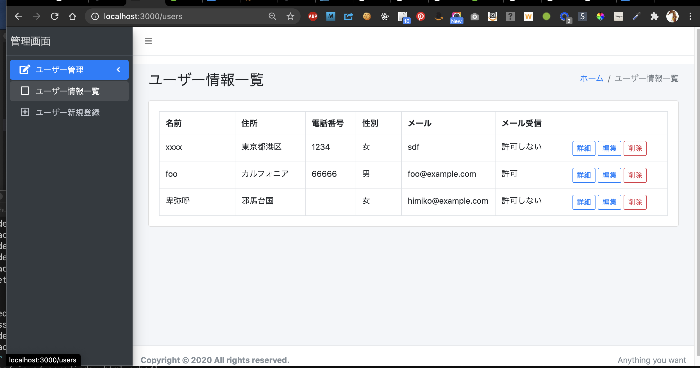
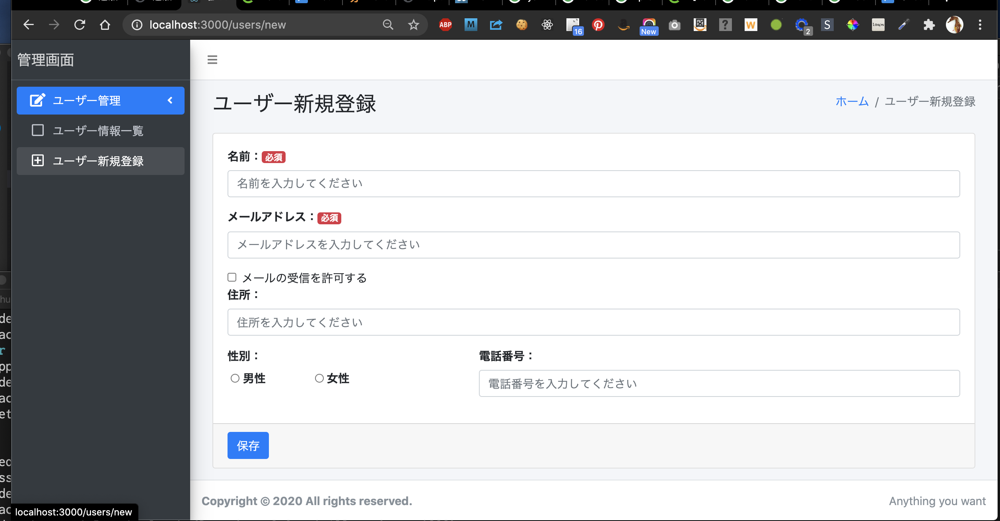
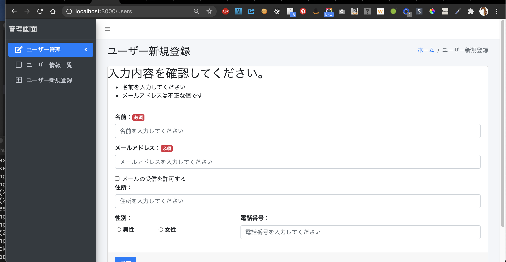
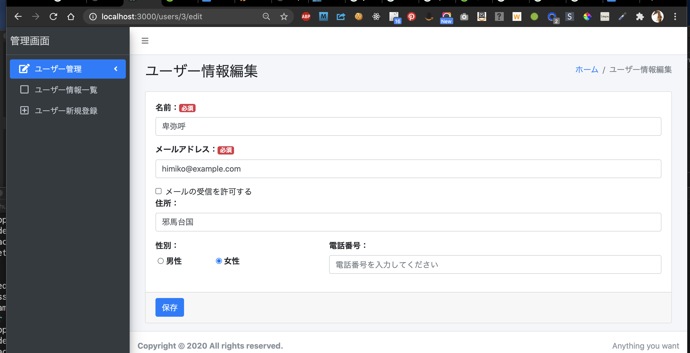

# README

Rails6 + AdminLTE3 での 一蘭、編集、詳細画面を作成した例です。

## スクリーンショット

## See 

* <https://medium-company.com/ruby-on-rails-%e7%92%b0%e5%a2%83%e6%a7%8b%e7%af%89/>
  Ruby on Railsの開発環境構築

この記事とは、AdminLTE の導入方法や、各種画面のレイアウトはすこし変更しています。
このレポジトリーでは、作業毎に commit をしています。
